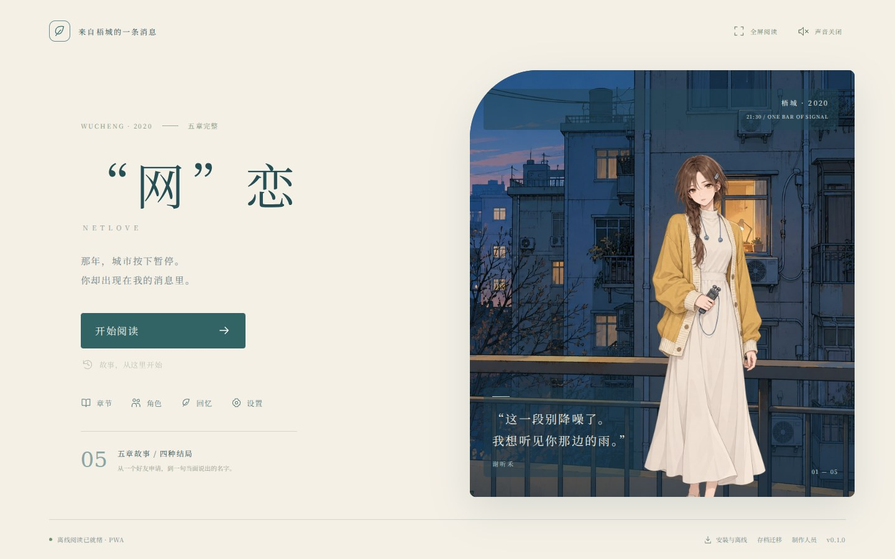

# “网”恋 / NetLove

> 那年，城市按下暂停。你却出现在我的消息里。

2020 年架空城市“梧城”的原创视觉小说。五章完整可玩初版 v0.1.0，PWA 与 Windows 共用同一份故事与资源。

你扮演二十三岁的周既明，在社区互助群中认识声音设计学生谢听禾与照相馆助理许弥。好友申请、第一次通话、被误传的照片、离线的夜晚与线下邀约，通向两条感情结局、友情或认真道别。

43 个场景，507 段文字，六次选择，288 条路线。两位角色原创透明立绘、五处梧城场景；完整中文字体、离线阅读、本地存档与 JSON 双端迁移。



[在线游玩 / 安装 PWA](https://aureliuswu.github.io/NetLove/) · [Windows 安装版 / 便携版 / PWA ZIP](https://github.com/AureliusWu/NetLove/releases/tag/v0.1.0)。公开 PWA 已验证断网续读，Windows 源码与实际 EXE 启动检查均通过。完整发布与验证记录见 [STATUS](docs/STATUS.md)、[VALIDATION](docs/VALIDATION.md) 和 [构建凭据](docs/production/BUILD-v0.1.0.json)。

## 开发与游玩

Node.js 24：

```bash
npm ci
npm run dev
```

生产 PWA：`npm run build && npm run preview`；Windows：`npm run desktop:win`。网页可横屏游玩，安装到主屏幕后优先横屏；联网缓存完整故事后能断网重开。

底部半透明阅读层集成存档、回看、自动、快进、隐藏、全屏和设置；透明度调整独立持久化。空格/Enter 推进，H 隐藏/恢复，S 存档，L 回看，A 自动。隐藏与旋转保留当前段落，自动/快进在选择与章末停下。

## 三项目复用

采用 Project1 的 React/Electron 双端框架和阅读交互，Test 的剧情数据、素材溯源与实际包验收方法。本轮将 [共用制作契约](docs/production/SHARED-VN.md) 与 [结构检查脚本](scripts/vn-contract.mjs) 同步回两个来源仓库，保留各作品的引擎、故事和存档标识。

[完整剧情](docs/STORY.md) · [人物设定](docs/CHARACTERS.md) · [架构](docs/ARCHITECTURE.md) · [最终美术请求](docs/prompts/ART-v1.json) · [资源来源](docs/production/ART-ASSETS.json)

```bash
node scripts/vn-contract.mjs src/story/story.json
npm test
npm run build
npx playwright install chromium
npm run test:e2e
npm run test:desktop
npm run test:desktop:packaged
```

当前每位角色一张基础立绘；暂无角色配音、表情图集、三视图、事件 CG 或云存档。代码与文本 MIT，字体 SIL OFL；授权文本随播放器提供。原图、生成请求和源码均保留。
