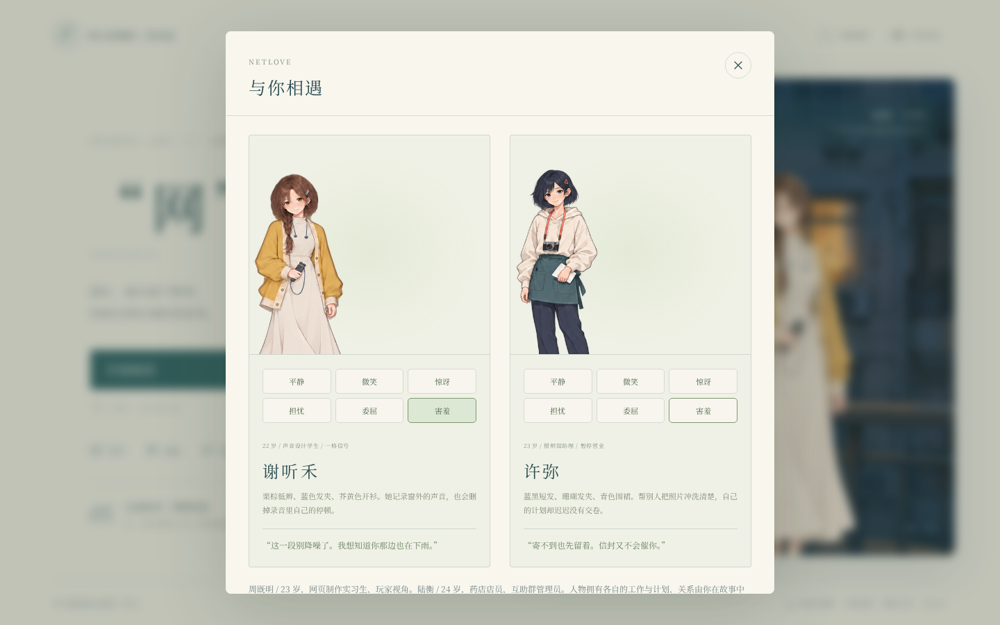

> 2026-10-17：v0.2.5 已发布为可玩预览，修复后台打字与同段读档，保留标题页继续原字数。[Build 39004333641](https://github.com/AureliusWu/NetLove/actions/runs/39004333641) 的 49 项逻辑、44 项浏览器与 Windows 源码/实际 EXE 检查通过；[Pages 39004628048](https://github.com/AureliusWu/NetLove/actions/runs/39004628048) 三屏离线通过。四份公开下载、PWA ZIP 22 文件及线上入口/worker 已实际回读校验，见 [发布回执](docs/production/PUBLISHED-v0.2.5.json)。

> 2026-10-16：v0.2.4 已完成发布验证。[Build 38827582748](https://github.com/AureliusWu/NetLove/actions/runs/38827582748) 通过 49 项逻辑、34 项完整浏览器和 Windows 源码/实际 EXE 检查；[v0.2.4 下载](https://github.com/AureliusWu/NetLove/releases/tag/v0.2.4) 四项公开文件已实际下载核验，[Pages 38828223622](https://github.com/AureliusWu/NetLove/actions/runs/38828223622) 三屏断网续读通过。见 [发布凭据](docs/production/PUBLISHED-v0.2.4.json)。安装器安装/升级和 portable 封装器启动未测。

> 2026-10-13：v0.2.0 剧情与六表情精修已发布；Windows 成品、浏览器及公开 PWA 通过本次 CI。见 [精修记录](docs/production/CREATIVE-REVIEW.md) 与 [发布凭据](docs/production/PUBLISHED-v0.2.0.json)。

# “网”恋 / NetLove

> 那年，城市按下暂停。你却出现在我的消息里。

2020 年架空城市“梧城”的原创视觉小说。五章完整可玩预览，当前制作版本 v0.2.5；PWA 与 Windows 共用同一份故事与资源。

你扮演二十三岁的周既明，在社区互助群中认识声音设计学生谢听禾与照相馆助理许弥。好友申请、第一次通话、被误传的照片、离线的夜晚与线下邀约，通向两条感情结局、友情或认真道别。

43 个场景，507 段文字，六次选择，288 条路线。两位角色各六种表情、五处梧城场景；完整中文字体、离线阅读、本地存档与 JSON 双端迁移。



[在线游玩 / 安装 PWA](https://aureliuswu.github.io/NetLove/) · [当前已发布 v0.2.5 Windows 安装版 / 便携版 / PWA ZIP](https://github.com/AureliusWu/NetLove/releases/tag/v0.2.5) · [v0.2.0 电脑/手机预览](docs/previews/v0.2.0/README.md)。正文精修与表情重建保留原有路线和存档。

2026-10-11 双端工程交付完成：测试代码 `d013a9a95b18ddeab23fb72df12fe67efa509b96` 的 [Build 38110158252](https://github.com/AureliusWu/NetLove/actions/runs/38110158252) 与 [Pages 38110407401](https://github.com/AureliusWu/NetLove/actions/runs/38110407401) 均通过，v0.1.1 预发布标签精确指向该提交。CI 和独立公网浏览器分别通过电脑、手机、横屏的真实断网刷新与续读；入口和 Service Worker 哈希与该 CI 的 PWA 产物一致。两份公开 EXE 与 PWA ZIP 已实际下载并核对发布校验表。发布资产的真实大小、SHA-256 和验收边界见 [PUBLISHED](docs/production/PUBLISHED-v0.1.1.json)；本机构建另记 [LOCAL-VALIDATION](docs/production/LOCAL-VALIDATION-v0.1.1.json)，最新状态见 [STATUS](docs/STATUS.md) 与 [VALIDATION](docs/VALIDATION.md)。v0.1.0 历史凭据继续保留。

## 开发与游玩

Node.js 24：

```bash
npm ci
npm run dev
```

生产 PWA：`npm run build && npm run preview`；Windows：`npm run desktop:win`。网页可横屏游玩，安装到主屏幕后优先横屏；联网缓存完整故事后能断网重开。

底部半透明阅读层集成存档、回看、自动、快进、隐藏、全屏和设置；透明度调整独立持久化。空格/Enter 推进，H 隐藏/恢复，S 存档，L 回看，A 自动。隐藏与旋转保留当前段落，自动/快进在选择与章末停下。

## 三项目复用

采用 Project1 的 React/Electron 双端框架和阅读交互，Test 的剧情数据、素材溯源与实际包验收方法。当前 Rain、NetLove 与 Healing 共用 [制作契约 v1.2.0](docs/production/SHARED-VN.md)、[精修方法与场景模板](docs/production/CREATIVE-PLAYBOOK.md)、[结构检查脚本](scripts/vn-contract.mjs) 和 [可复用素材校验/导出](docs/production/REUSABLE-MATERIALS.md)，保留各作品的引擎、故事和存档标识。素材包包含带许可的字体与加工模板、实际 PWA 交付适配器；人物和场景原图按作品追溯，排除在通用导出包外。

[完整剧情](docs/STORY.md) · [人物设定](docs/CHARACTERS.md) · [架构](docs/ARCHITECTURE.md) · [六表情美术请求](docs/prompts/ART-v2.json) · [资源来源](docs/production/ART-ASSETS.json)

```bash
node scripts/vn-contract.mjs src/story/story.json
node scripts/vn-materials.mjs verify
npm run test:materials
npm test
npm run build
npx playwright install chromium
npm run test:e2e
npm run test:desktop
npm run test:desktop:packaged
```

`npm run check` 串行执行共用素材、逻辑、构建与浏览器门禁。CI 导出 `NetLove-Reusable-Materials` 附件；本地可用 `node scripts/vn-materials.mjs export .reuse-kit/<新名称>` 创建带固定哈希和逐项许可的材料包，已有包不会覆盖。

两位角色的表情按原段落重建，旁白继承上一拍，匿名聊天与纯声音通话保留隐藏立绘。代码与文本 MIT，字体 SIL OFL；授权文本随播放器提供。原图、生成请求和源码均保留。
